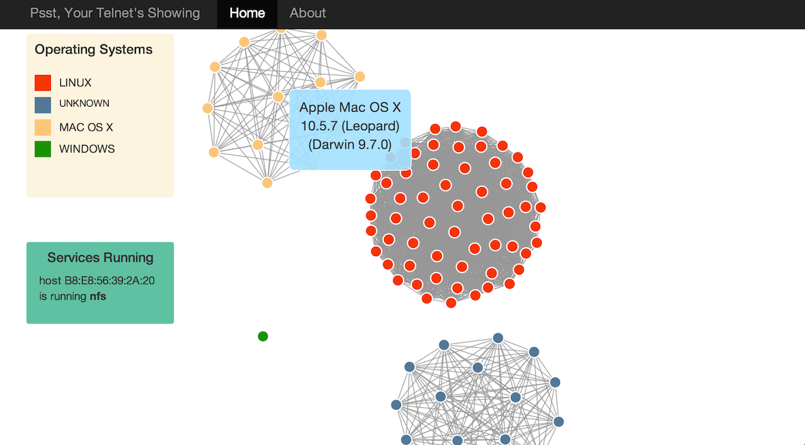
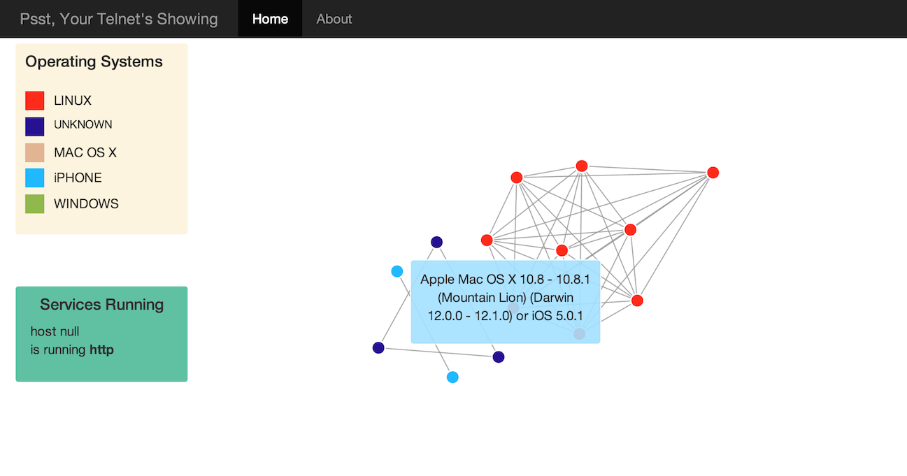

**Psst, Your Telnet Is Showing**
================================

The Psst, Your Telnet Is Showing application visualizes information about hosts connected to the user's network. Psst scans for open ports to get the dirt on who's available: their IP addresses, which ports are open, what version of operating system they're running, and type of device. It displays the information as an interactive user interface, created in D3.

To run Psst, open Terminal and run `python views.py`. To run the port scanner separately, run `python portscanner.py`. The user must be the root.

**Port Scanning**
**(portscanner.py)**

By default, Psst begins by finding the user's IP address and the number of hosts on the network s/he is connected to. The number of hosts is determined via the subnet mask. For the scope of my project, I've set the default subnet mask as 255.255.255.0. 

To find which hosts are available, I used FPing,  which sends Internet Control Message Protocol (ICMP) echo request packets to each host; if FPing receives a response, then the host is reachable. Ping, the Unix utility typically used for host discovery, waits for a response from each host before moving on to the next one. FPing is great because it works in parallel — so much faster! 

Port scanning is handled using Python's NMAP (Network Mapper) module. NMAP is a security scanner that sends packets to target the available hosts and outputs the result in XML. 

Parsing with Beautiful Soup
**(beautiful__soup__parsing.py)**

Parses the XML output from portscanner.py into JSON, which D3 handles better.

**Flask Views (aka the Controller) **
**(views.py)**
The web app runs on Python's Flask framework.
Routes:
“/”: displays the main index.
“/scan”: refreshes the current network scan.

**Background Process**
**(daemon.py)**
Script to run portscanner.py as a background process. Ensures that only one scan can run at a time. If user tries to run an additional scan while one is already in progress, the daemon will send an error message. Performs UNIX [double fork magic](http://joyrex.spc.uchicago.edu/bookshelves/python/cookbook/pythoncook-CHP-6-SECT-8.html) in Python.

**User Interface**
**(base.html, index.html)**
The front-end makes use of D3, Bootstrap, and Jinja. These files are stored in Templates. 

